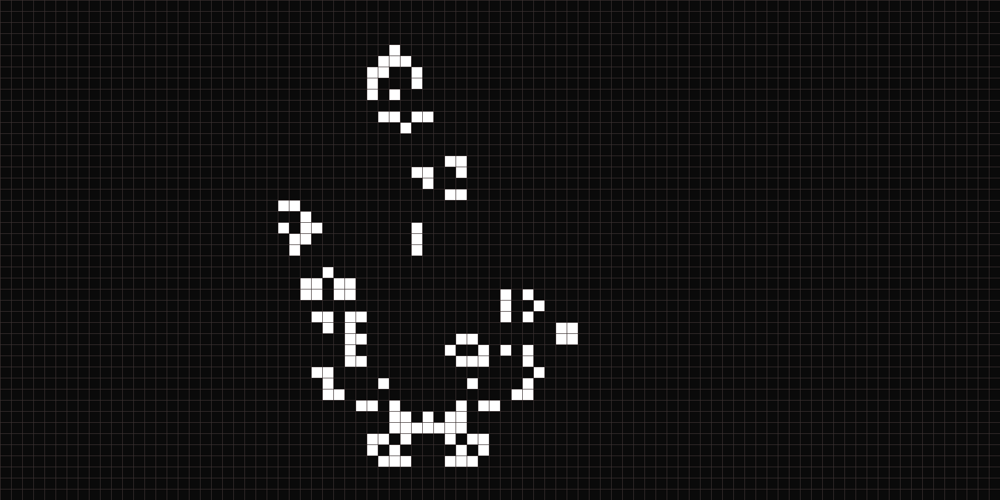

### Pygame of Life

**Pygame of Life** is a Python implementation of Conway's Game of Life using Pygame. The Game of Life is a cellular automaton where cells on a grid live, die, or reproduce based on simple rules. Despite its simplicity, it can simulate complex patterns over time.

The rules of the Game of Life:
1. Any live cell with two or three live neighbors survives.
2. Any dead cell with exactly three live neighbors becomes a live cell.
3. All other live cells die, and dead cells remain dead.

Here's an example of the grid in action:

